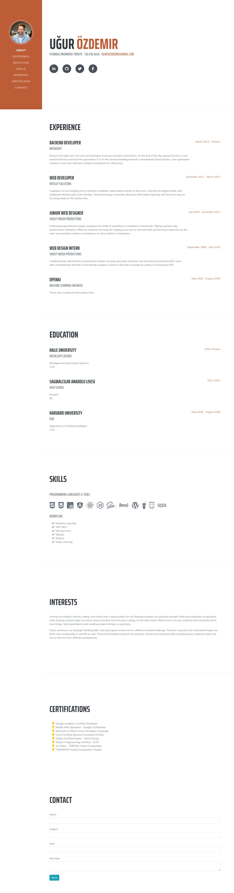
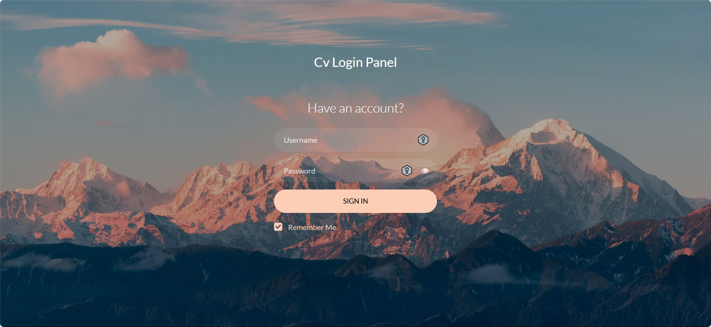
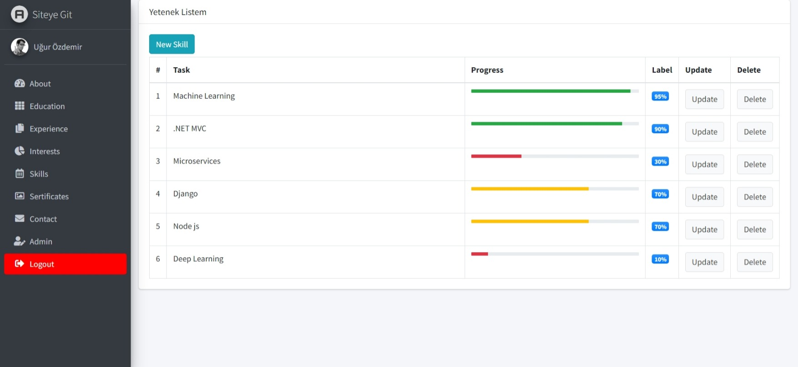
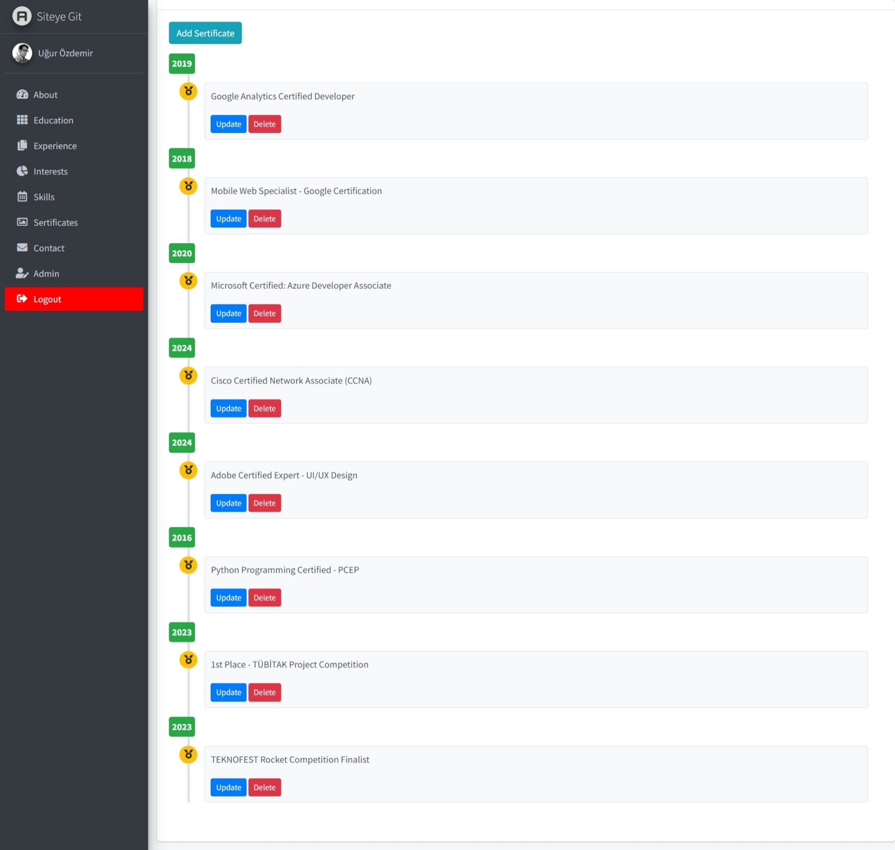
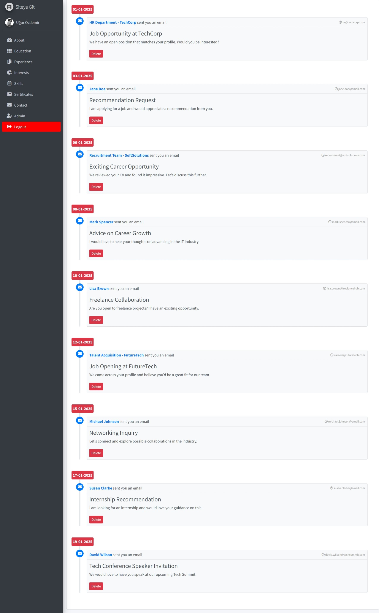

# 🌟 Kişisel CV Projesi

## 📄 Proje Hakkında

Bu proje, **kişisel bilgilerini, yeteneklerini, eğitim geçmişini, hobilerini, sertifikalarını** ve diğer önemli bilgilerini modern bir şekilde sergilemek amacıyla geliştirilmiş bir CV (özgeçmiş) web uygulamasıdır. Kullanıcılar, kendilerini en iyi şekilde ifade edebilmek ve güncel tutabilmek için bu projeyi kullanabilir.

---

## ✨ Özellikler

- **👤 Kişisel Bilgiler & Yetenekler:** Kolayca düzenlenebilir bilgiler.
- **🎓 Eğitim, Sertifikalar & Deneyimler:** Şık ve modern bir sunum.
- **🎨 Hobiler & İlgi Alanları:** Kişisel zevklerin ön planda.
- **📁 Repository Design Pattern:** Temiz ve sürdürülebilir veri erişimi.
- **🗄️ DB First Yaklaşımı:** Varolan veritabanından model oluşturma.
- **🔒 Admin Paneli & Authorization:** Sadece yetkili kullanıcılar erişebiliyor.
- **🔄 Kullanıcı Bilgileri Güncelleme:** Admin panelinden kullanıcı adı ve şifre düzenleme.
- **✉️ İletişim Modülü:** Anasayfadan gönderilen mesajlar admin panelinde görüntüleniyor.

---

## ✨ Fotoğraflar

---
## 🛠️ Kullanılan Teknolojiler

- **Backend:** ASP.NET MVC  
- **Veri Erişim:** Entity Framework (DB First Yaklaşımı)  
- **Repository Design Pattern:** Modüler veri erişimi  
- **Frontend:** HTML5, CSS3, Bootstrap
- **JavaScript & jQuery:** Dinamik etkileşimler
- **Yetkilendirme:** FormsAuthentication

---

Bu proje Murat Yücecağ'ın "Mvc5 ile Sıfırdan Admin Panelli Dinamik CV Sitesi" kursuna aittir.
Kursa bu linkten ulaşabilirsiniz: https://www.udemy.com/course/mvc5-ile-sfrdan-admin-panelli-dinamik-cv-sitesi/
